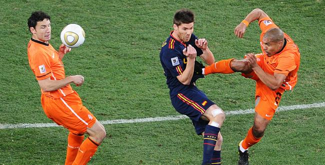

<!Doctype html>
<html>
<body>

<h1>Common Soccer Foul</h1>

<h2>1. Slide Tackling</h2>

Slide tackling is when you slide on the floor with one leg extending to push the ball away from a player. This is a foul because this can injure a player from missing the ball to dislocating the ankle. If a slide tackle is commited, the player that did the slide tackling must be sent to the sin bin.

<h2>2. Pushing</h2>

Pushing is when you physically use your force to drag someone away from you. This is a foul because the victim can lose their balance and fall. Although pushing with shoulders is allowed, pushing with hands is not because it can create a larger force where with shoulders doesnt impact the victim as much.

<h2>3. Kicing a player</h2>

Kicing a player may not always be intentional, but it is still a foul. Even if its accidental and you're trying to get the ball you cannot physically kick a player. Some alternatives to getting the ball can be marking the players on the opposing team. You can get the ball any way except by physically injuring or hurting a player.

<h2>4. Holding an opponent</h2>

Holding an opponent can be helpful, except, its not allowed. Holding the opponents shirt, pants, leg if they fell or holding them to decrease their mobility is an offense in soccer. Players should not be holding or be held in soccer as it is an obvious offense and a clear foul.

<h3>Although there are way more soccer fouls 0</h3>

</body>
</html>
